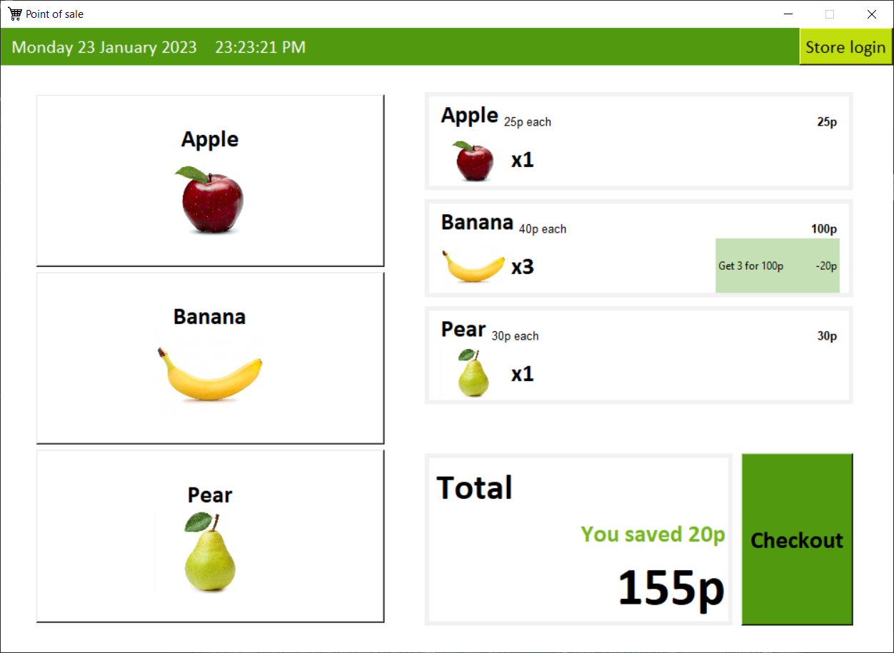
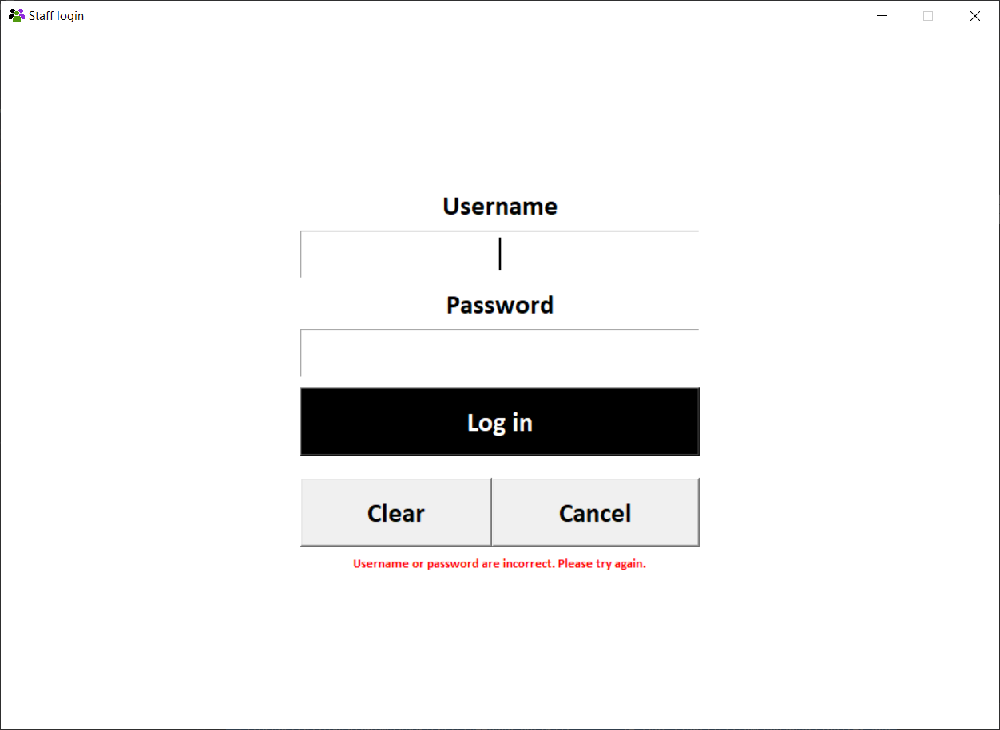
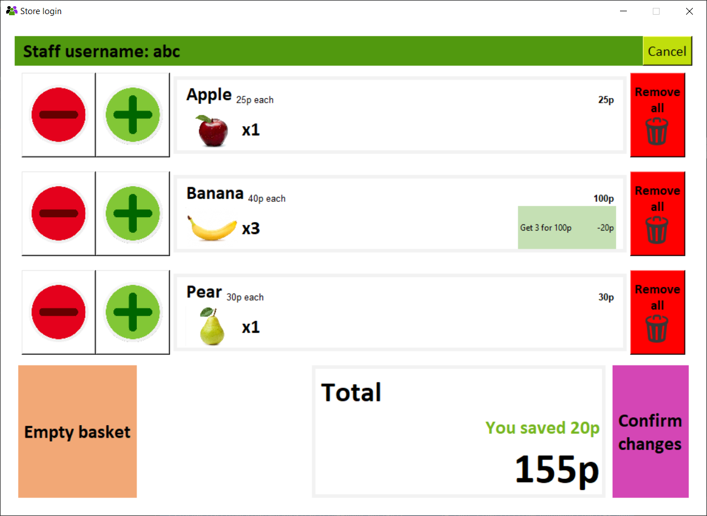

# MockPOS
A Point of Sale GUI application written in Python

### How to run
- Confirm you have the modules listed in the requirements.txt
- Open a terminal in the src directory and type
```
python PointOfSale.py
```

### How to use the application as a regular customer
- Click on the buttons on the left to add items in the basket.
- Click checkout to finalise the shopping, print the total cost on the terminal and clear the basket
- Click Store login for advanced controls on the basket



### How to log in as a member of staff
- Enter login credentials: username: abc, password: 123


### How to use the application as a member of staff
- Add or remove items one by one using the +/- buttons.
- Remove all items of a specific category
- Remove all items from the basket
- Confirm your changes or cancel at any time


### How to test
- Open a terminal in the tests directory and type
```
python -m unittest
```
